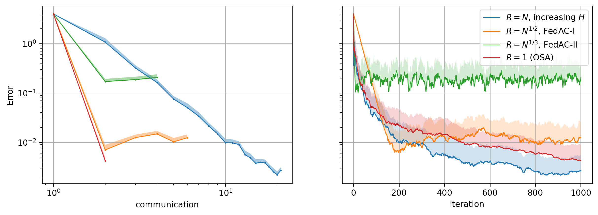

# Local-SGD-re

Quadratic with $$ F(\mathbf x) = \mathbb E_\zeta f(\mathbf x, \zeta), \qquad f(\mathbf x, \zeta) := \sum_{i=1}^d \frac{i}{2}x_i^2 (1 + z_{1,i}) + \mathbf x^\top \mathbf z_2. $$

Quadratic with $f(x) = x^2$ for $x>0$ and $\frac{1}{2}x^2$ for $x\leq 0$.

